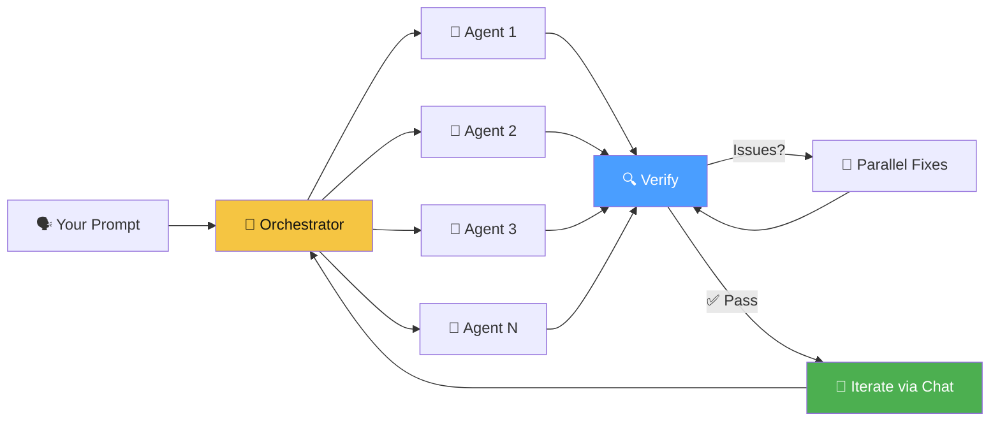
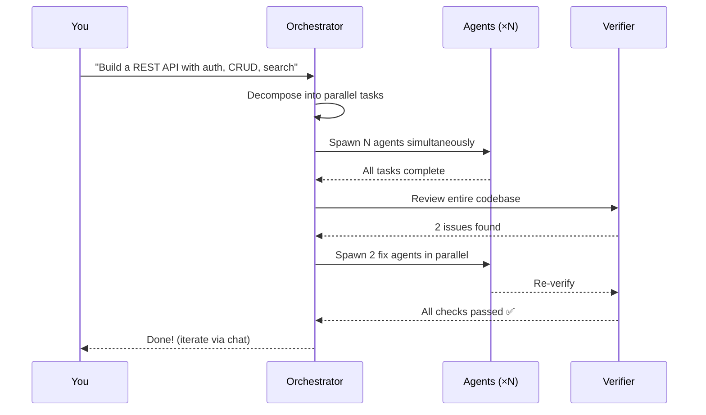

<p align="center">
  
</p>

<h1 align="center">hAIvemind</h1>

<p align="center">
  <strong>Many small agents. One hivemind.</strong><br>
  Massively parallel AI coding orchestrator powered by GitHub Copilot CLI
</p>

<p align="center">
  
  
  
  
</p>

---

Describe what you want. The hivemind decomposes it, spins up parallel agents, verifies the result, fixes issues autonomously, and lets you iterate — all from a visual DAG.



## Why hAIvemind?

| Problem | hAIvemind |
|---------|-----------|
| AI agents work sequentially | **All independent tasks run simultaneously** |
| One model does everything | **4-tier model escalation** — free models first, premium only when needed |
| No visibility into what's happening | **Live DAG** with real-time status, runtime timers, edge highlighting |
| Verification is an afterthought | **Verify-fix loop** — orchestrator reviews, decomposes fixes, re-verifies |
| One-shot generation | **Iterative chat** — extend the DAG with follow-up requests |

## Quick Start

```bash
git clone git@github.com:MrUnreal/hAIvemind.git
cd hAIvemind
npm install
npm run dev
```

> Requires **Node.js 18+** and **GitHub Copilot CLI** on PATH.
> See [Setup Guide](docs/setup.md) for detailed instructions.

Open **http://localhost:5173** → pick a project → describe what to build → watch agents swarm.

## How It Works



1. **Decompose** — Orchestrator breaks your request into independent tasks with pre-specified interfaces so agents don't wait for each other
2. **Execute** — All independent tasks launch simultaneously as separate Copilot CLI processes
3. **Verify** — Orchestrator reviews the full codebase for integration issues
4. **Fix** — Issues are decomposed into parallel fix tasks, added to the DAG, and executed
5. **Iterate** — Send follow-up messages to grow the DAG with new work

## Key Features

🐝 **Maximum Parallelism** — Every independent task runs at once. 7 tasks? 7 simultaneous agents.

📊 **Live DAG Visualization** — Real-time graph with status colors, runtime timers, active edge highlighting, and auto-viewport focus on running nodes.

💬 **Orchestrator Chat** — iMessage-style panel showing every agent assignment, completion, and escalation. Send follow-up requests to extend the project.

🔄 **Verify-Fix Loop** — Automated feedback loop: verify → decompose fixes → parallel fix agents → re-verify. Up to 3 rounds.

⬆️ **Smart Escalation** — `T0 → T0 → T1 → T2 → T3`. Starts free, upgrades only when needed. [Model details →](docs/model-tiering.md)

📁 **Project Isolation** — Each project gets its own workspace directory and session history.

## Screenshots

<p align="center">
  <br>
  <em>Live DAG — 7 agents executing in parallel</em>
</p>

## Docs

| Page | Description |
|------|-------------|
| [Setup Guide](docs/setup.md) | Prerequisites, installation, configuration |
| [Architecture](docs/architecture.md) | System design, component breakdown, data flow |
| [Model Tiering](docs/model-tiering.md) | All supported models, tiers, costs, escalation chain |
| [Project Structure](docs/project-structure.md) | File-by-file codebase reference |

## License

MIT
