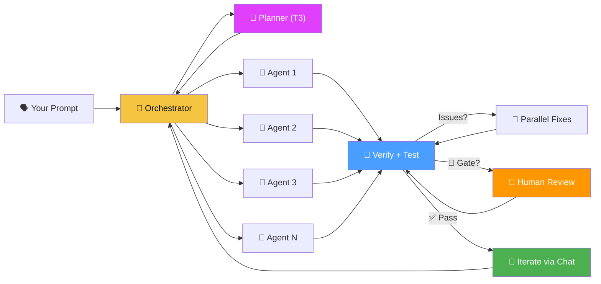
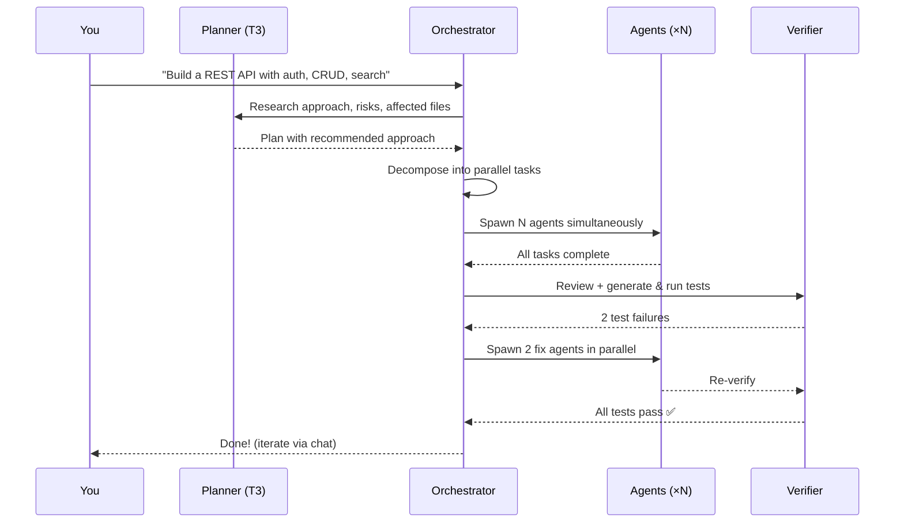

<p align="center">
  
</p>

<h1 align="center">hAIvemind</h1>

<p align="center">
  <strong>Many small agents. One hAIvemind. Self-evolving.</strong><br>
  Massively parallel AI coding orchestrator powered by GitHub Copilot CLI
</p>

<p align="center">
  
  
  
  
  
</p>

> **Every feature in this codebase was developed by hAIvemind's own orchestrator.** No manually written code is present — the platform decomposes its own feature requests, spawns agents to implement them, verifies the results, and merges passing changes. The hAIvemind builds itself.

---

Describe what you want. The hAIvemind decomposes it, spins up parallel agents, verifies the result, fixes issues autonomously, and lets you iterate — all from a visual DAG.



## Why hAIvemind?

| Problem | hAIvemind |
|---------|-----------|
| AI agents work sequentially | **All independent tasks run simultaneously** |
| One model does everything | **4-tier model escalation** — free models first, premium only when needed |
| No visibility into what's happening | **Live DAG** with real-time status, runtime timers, streaming output |
| Verification is an afterthought | **Test-driven verify-fix loop** — generates and runs actual tests, failures become fix tasks |
| One-shot generation | **Iterative chat** — extend the DAG with follow-up requests |
| AI can't improve itself | **Self-development mode** — hAIvemind evolves its own codebase via git worktrees |

## Quick Start

```bash
git clone git@github.com:MrUnreal/hAIvemind.git
cd hAIvemind
npm install
cd client && npm install && cd ..
npm run dev
```

Or with Docker:
```bash
docker compose up
```

> Requires **Node.js 18+** and **GitHub Copilot CLI** on PATH.
> Copy `.env.example` to `.env` and customize settings.
> See [Setup Guide](docs/setup.md) for detailed instructions.

Open **http://localhost:5173** → pick a project → describe what to build → watch agents swarm.

### CLI Usage

```bash
# List projects
npx haivemind projects

# Build something
npx haivemind build my-project "Add user authentication with JWT"

# Autopilot mode
npx haivemind autopilot my-project --cycles=5

# Run tests
npm test
```

## How It Works



1. **Plan** — T3 model researches the codebase, evaluates approaches, identifies risks and affected files
2. **Decompose** — Orchestrator breaks the plan into independent tasks with pre-specified interfaces
3. **Execute** — All independent tasks launch simultaneously as separate Copilot CLI processes
4. **Verify** — Orchestrator generates and runs actual tests, reviews the full codebase for integration issues
5. **Fix** — Test failures are decomposed into parallel fix tasks, added to the DAG, and executed
6. **Iterate** — Send follow-up messages to grow the DAG with new work

## Features

Every feature below was built by the hAIvemind's own orchestrator — decomposed, executed in parallel, verified, and merged autonomously.

### Core Engine
🐝 **Maximum Parallelism** — Every independent task runs at once. 7 tasks? 7 simultaneous agents.

📊 **Live DAG Visualization** — Real-time graph with status colors, runtime timers, active edge highlighting, and auto-viewport focus on running nodes.

💬 **Orchestrator Chat** — iMessage-style panel showing every agent assignment, completion, and escalation. Send follow-up requests to extend the project.

🧪 **Test-Driven Verification** — Verify step generates and runs actual tests (`node --check`, smoke tests, `npm test`). Test failures become fix tasks automatically. Up to 3 verify-fix rounds.

🔬 **Planner Mode** — Before coding, a T3 model researches the codebase, evaluates multiple approaches, identifies risks and affected files. Planning is separate from execution.

⬆️ **Smart Escalation** — `T0 → T0 → T1 → T2 → T3`. Starts free, upgrades only when needed. [Model details →](docs/model-tiering.md)

🤝 **Human-in-the-Loop Gates** — Mark tasks as requiring human approval before proceeding. The DAG pauses at gate nodes, you review, approve or redirect with feedback.

📁 **Project Isolation** — Each project gets its own workspace directory and session history. Link existing repos or create fresh projects.

### Operations (Phase 5)
🛡️ **Graceful Shutdown & Recovery** — `SIGTERM`/`SIGINT` handlers flush sessions to disk. On restart, interrupted sessions can be resumed or discarded.

📝 **Smart Output Summaries** — Post-run structured summaries (files changed, errors, test results). Summaries replace raw output on escalation to stay within token limits.

⏪ **Workspace Rollback** — Pre-session git snapshots, one-click rollback, file-level diff preview before undoing changes.

⌨️ **CLI Mode** — `haivemind build <project> "prompt"` for headless/CI use. Color-coded streaming output, `--json` mode, exit codes.

🤖 **Auto-Pilot** — `haivemind autopilot <slug>` runs reflect→plan→build cycles autonomously with safety rails (cost ceiling, max cycles, mandatory tests).

🐳 **Distribution** — `Dockerfile`, `docker-compose.yml`, `npm start` for production. One-command deploy.

🔌 **Plugin System** — Load/unload/enable/disable plugins with lifecycle hooks (`beforeSession`, `afterSession`, `afterPlan`, `onShutdown`). REST API + Settings UI.

⚙️ **Backend & Swarm REST** — Switch backends (Copilot/Ollama) and toggle swarm mode at runtime without restart.

### Production Readiness (Phase 6)
🧪 **CI Pipeline** — GitHub Actions workflow, Playwright auto-server, `npm test` / `npm run test:ci` scripts.

📋 **Structured Logging** — Leveled logger (error/warn/info/debug), timestamp-prefixed, JSON mode for production (`LOG_FORMAT=json`).

🌐 **Environment Config** — `.env` file support, all config overridable via `HAIVEMIND_*` env vars. No hardcoded values.

📑 **Template Gallery** — Browse, preview, and create project templates from the UI. Variable substitution and stack badges.

⚡ **Real-Time Agent Streaming** — Throttled `AGENT_STREAM` with progressive terminal rendering, output search/filter, raw/summary toggle.

🔍 **Session Diff Viewer** — Per-file unified diffs with syntax highlighting. Workspace overview showing tech stack, file tree, conventions.

🔌 **Plugin & Backend UI** — Settings panel with enable/disable/reload toggles, backend selector, swarm capacity display.

🤖 **Autopilot Web UI** — Start/stop autopilot from the browser, cycle history, reasoning, cost tracking, real-time progress.

📡 **Scoped WebSocket Channels** — Per-project subscriptions, session checkpointing for crash recovery, zero cross-project noise.

🧬 **Self-Development Mode** — hAIvemind evolves its own codebase. New features are developed in isolated git worktrees, verified, diffed, and merged — the platform builds itself.

## Screenshots

<p align="center">
  <br>
  <em>Live DAG — 7 agents executing in parallel</em>
</p>

## Docs

| Page | Description |
|------|-------------|
| [Setup Guide](docs/setup.md) | Prerequisites, installation, configuration |
| [Architecture](docs/architecture.md) | System design, component breakdown, data flow |
| [Model Tiering](docs/model-tiering.md) | All supported models, tiers, costs, escalation chain |
| [Project Structure](docs/project-structure.md) | File-by-file codebase reference |
| [Roadmap](docs/roadmap.md) | Feature backlog and status tracking |
| [Definition of Done](docs/definition-of-done.md) | Quality standards and self-dev rules |

## Roadmap

| Phase | Status | Highlights |
|-------|--------|------------|
| Foundation | ✅ | Parallel agents, DAG visualization, chat, verify-fix loops, gates |
| Phase 1: Reliability | ✅ | Process timeouts, error recovery, session locking, memory management |
| Phase 2: Intelligence | ✅ | Persistent skills, escalation control, self-reflection metrics |
| Phase 3: Extensibility | ✅ | DAG rewriting, pluggable backends, multi-workspace swarm |
| Phase 4: Hardening | ✅ | Workspace analysis, cost ceilings, per-project concurrency |
| Phase 5: Autonomy | ✅ | Graceful shutdown, CLI, autopilot, plugins, Docker distribution |
| Phase 6: Production | ✅ 7/8 | CI, logging, templates, streaming, diff viewer, plugin UI, autopilot UI, WS channels |
| Phase 6.8: Decomposition | 🔄 | Server modularization into routes/services/ws |

See [docs/roadmap.md](docs/roadmap.md) for the full feature backlog and [ROADMAP-PHASE6.md](ROADMAP-PHASE6.md) for Phase 6 details.

## License

MIT
