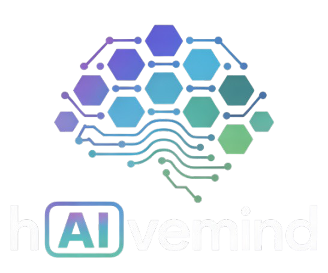
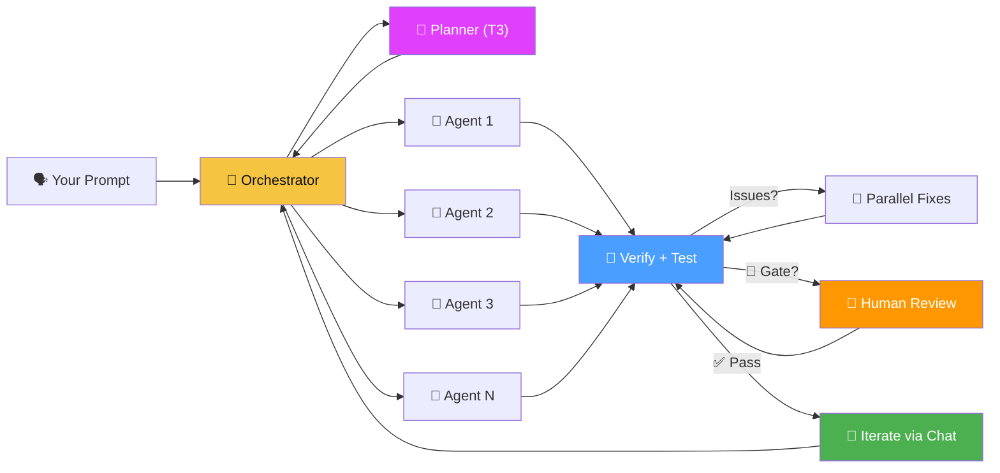
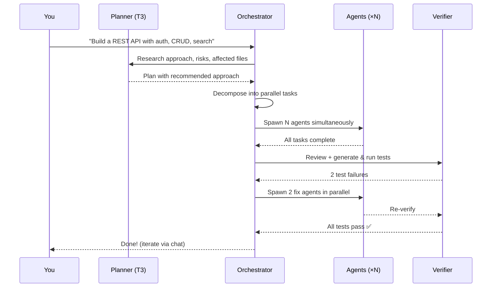
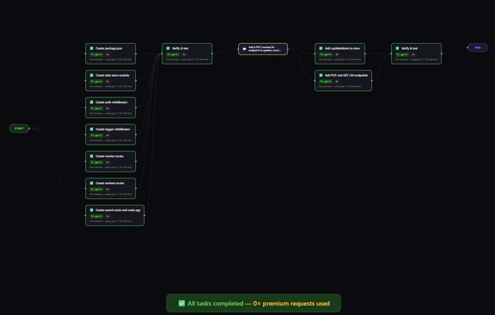

<p align="center">
  
</p>

<h1 align="center">hAIvemind</h1>

<p align="center">
  <strong>Many small agents. One hivemind. Self-evolving.</strong><br>
  Massively parallel AI coding orchestrator powered by GitHub Copilot CLI
</p>

<p align="center">
  
  
  
  
  
</p>

> **Every feature in this codebase was developed by hAIvemind's own orchestrator.** No manually written code is present — the platform decomposes its own feature requests, spawns agents to implement them, verifies the results, and merges passing changes. The hivemind builds itself.

---

Describe what you want. The hivemind decomposes it, spins up parallel agents, verifies the result, fixes issues autonomously, and lets you iterate — all from a visual DAG.



## Why hAIvemind?

| Problem | hAIvemind |
|---------|-----------|
| AI agents work sequentially | **All independent tasks run simultaneously** |
| One model does everything | **4-tier model escalation** — free models first, premium only when needed |
| No visibility into what's happening | **Live DAG** with real-time status, runtime timers, streaming output |
| Verification is an afterthought | **Test-driven verify-fix loop** — generates and runs actual tests, failures become fix tasks |
| One-shot generation | **Iterative chat** — extend the DAG with follow-up requests |
| AI can't improve itself | **Self-development mode** — hAIvemind evolves its own codebase via git worktrees |

## Quick Start

```bash
git clone git@github.com:MrUnreal/hAIvemind.git
cd hAIvemind
npm install
npm run dev
```

> Requires **Node.js 18+** and **GitHub Copilot CLI** on PATH.
> See [Setup Guide](docs/setup.md) for detailed instructions.

Open **http://localhost:5173** → pick a project → describe what to build → watch agents swarm.

## How It Works



1. **Plan** — T3 model researches the codebase, evaluates approaches, identifies risks and affected files
2. **Decompose** — Orchestrator breaks the plan into independent tasks with pre-specified interfaces
3. **Execute** — All independent tasks launch simultaneously as separate Copilot CLI processes
4. **Verify** — Orchestrator generates and runs actual tests, reviews the full codebase for integration issues
5. **Fix** — Test failures are decomposed into parallel fix tasks, added to the DAG, and executed
6. **Iterate** — Send follow-up messages to grow the DAG with new work

## Features

Every feature below was built by the hivemind's own orchestrator — decomposed, executed in parallel, verified, and merged autonomously.

🐝 **Maximum Parallelism** — Every independent task runs at once. 7 tasks? 7 simultaneous agents.

📊 **Live DAG Visualization** — Real-time graph with status colors, runtime timers, active edge highlighting, and auto-viewport focus on running nodes.

💬 **Orchestrator Chat** — iMessage-style panel showing every agent assignment, completion, and escalation. Send follow-up requests to extend the project.

🧪 **Test-Driven Verification** — Verify step generates and runs actual tests (`node --check`, smoke tests, `npm test`). Test failures become fix tasks automatically. Up to 3 verify-fix rounds.

🔬 **Planner Mode** — Before coding, a T3 model researches the codebase, evaluates multiple approaches, identifies risks and affected files. Planning is separate from execution.

⬆️ **Smart Escalation** — `T0 → T0 → T1 → T2 → T3`. Starts free, upgrades only when needed. [Model details →](docs/model-tiering.md)

🤝 **Human-in-the-Loop Gates** — Mark tasks as requiring human approval before proceeding. The DAG pauses at gate nodes, you review, approve or redirect with feedback.

⚡ **Streaming Agent Output** — Live stdout/stderr per agent, broadcast in real-time over WebSocket. Watch agents think, not just finish.

🧬 **Self-Development Mode** — hAIvemind evolves its own codebase. New features are developed in isolated git worktrees, verified, diffed, and merged — the platform builds itself.

📁 **Project Isolation** — Each project gets its own workspace directory and session history. Link existing repos or create fresh projects.

## Screenshots

<p align="center">
  <br>
  <em>Live DAG — 7 agents executing in parallel</em>
</p>

## Docs

| Page | Description |
|------|-------------|
| [Setup Guide](docs/setup.md) | Prerequisites, installation, configuration |
| [Architecture](docs/architecture.md) | System design, component breakdown, data flow |
| [Model Tiering](docs/model-tiering.md) | All supported models, tiers, costs, escalation chain |
| [Project Structure](docs/project-structure.md) | File-by-file codebase reference |

## Roadmap

Features the hivemind will build for itself next:

🧠 **Persistent Skills** — Agents learn reusable scripts (lint, test, deploy) per project. Skills survive across sessions so the hivemind doesn't re-discover how to build/run your stack every time.

🎛️ **Escalation Control Panel** — UI to customize the escalation chain per project. Pin certain tasks to specific models, set cost ceilings, or force free-tier-only mode.

🔀 **Dynamic DAG Rewriting** — Orchestrator detects blocked dependency chains mid-execution and restructures the DAG on the fly — splitting, merging, or reordering tasks without restarting.

🌐 **Multi-Workspace Swarm** — Spawn agents across multiple machines or containers. Distribute work across a cluster, not just local processes.

🔌 **Pluggable Agent Backends** — Swap Copilot CLI for any agent runtime: Codex, Aider, Open Interpreter, local LLMs via Ollama. Mix backends in the same session.

📜 **Session Replay** — Full timeline scrubber for past sessions. Replay the DAG execution frame-by-frame, inspect every agent's output at any point.

📦 **Project Templates** — Pre-built skill packs for common stacks (Express API, React app, CLI tool). Hit the ground running with known-good decomposition patterns.

## License

MIT
