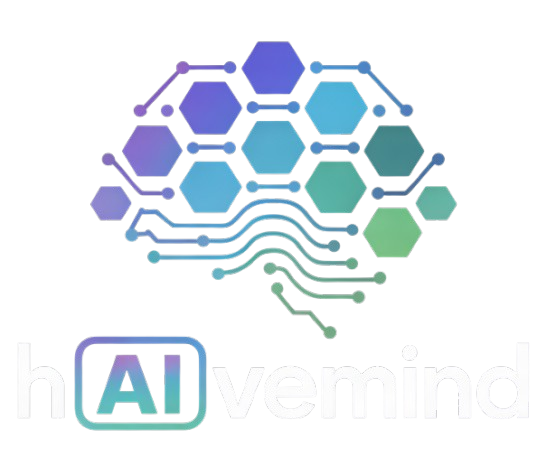
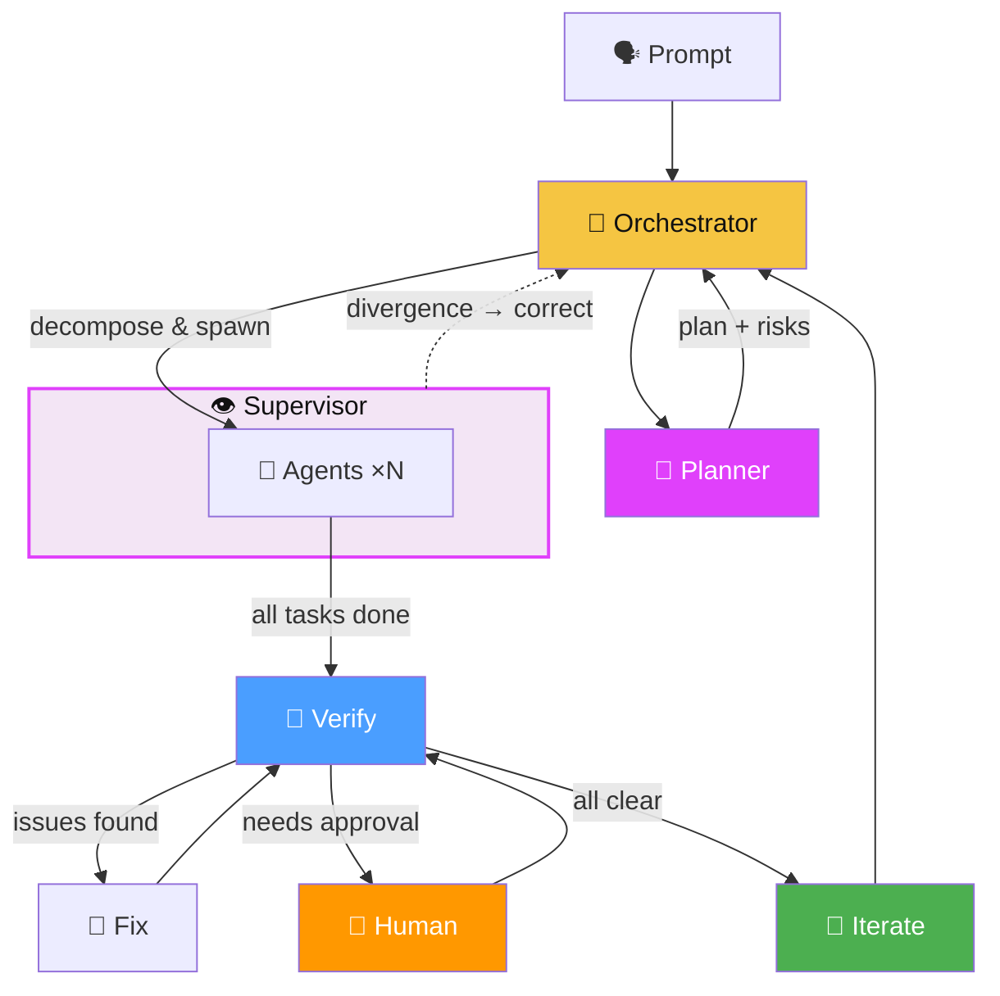
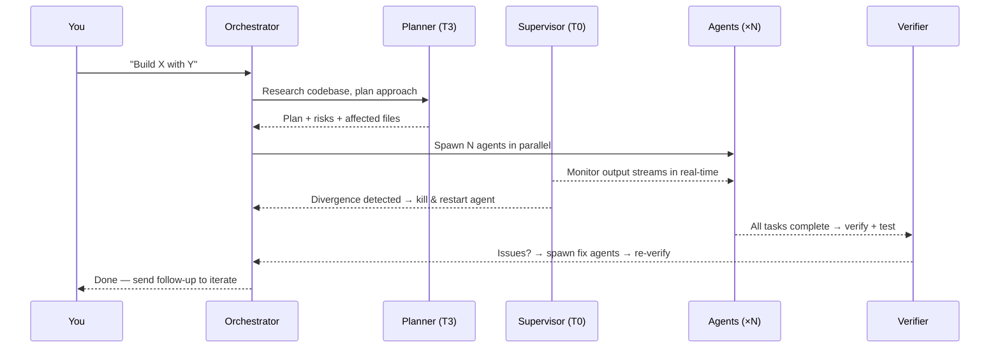
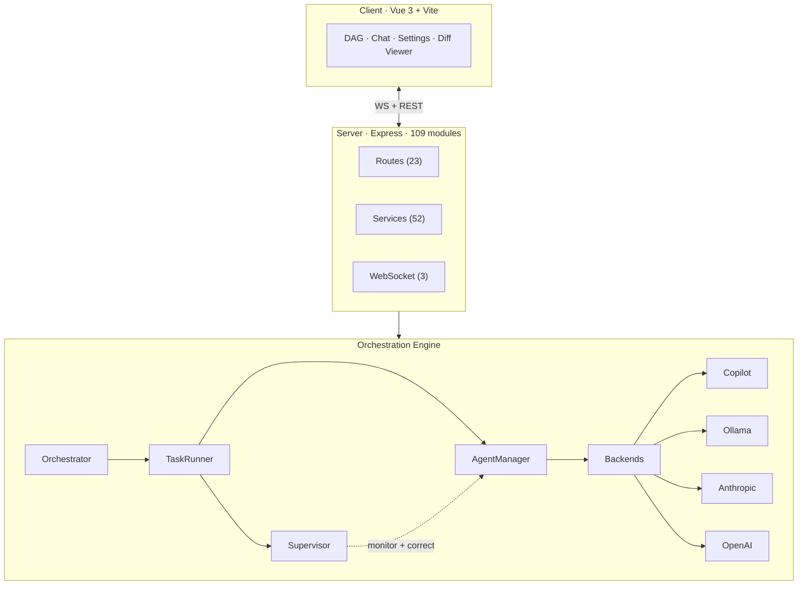
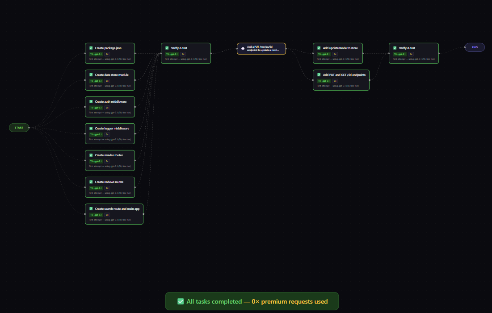

<p align="center">
  
</p>

<h1 align="center">hAIvemind</h1>

<p align="center">
  <strong>Many small agents. One hAIvemind. Self-evolving.</strong><br>
  Massively parallel AI coding orchestrator powered by GitHub Copilot CLI
</p>

<p align="center">
  
  
  
  
  
  
</p>

> **Every line of this codebase was written by hAIvemind itself.** 54K+ lines, 1915 tests, 21 phases, zero manual code.

---


```mermaid
graph TB
  A["🗣️ Prompt"] --> B["🧠 Orchestrator"]
  B --> P["🔬 Planner"]
  P -->|"plan + risks"| B

  subgraph SV["👁️ Supervisor"]
    AG["🐝 Agents ×N"]
  end

  B -->|"decompose & spawn"| AG
  SV -.->|"divergence → correct"| B
  AG -->|"all tasks done"| G["🧪 Verify"]
  G -->|"issues found"| H["🔧 Fix"] --> G
  G -->|"needs approval"| K["🤝 Human"] --> G
  G -->|"all clear"| I["💬 Iterate"] --> B

  style B fill:#f5c542,color:#111
  style P fill:#e040fb,color:#fff
  style SV fill:#f3e5f5,color:#111,stroke:#e040fb,stroke-width:2px
  style G fill:#4a9eff,color:#fff
  style K fill:#ff9800,color:#fff
  style I fill:#4caf50,color:#fff
```

## Quick Start

```bash
git clone git@github.com:MrUnreal/hAIvemind.git && cd hAIvemind
npm install && cd client && npm install && cd ..
npm run dev        # → http://localhost:5173
```

> **Requires:** Node.js 18+ · GitHub Copilot CLI on PATH · Copy `.env.example` → `.env`

## How It Works


```mermaid
sequenceDiagram
  participant U as You
  participant O as Orchestrator
  participant P as Planner (T3)
  participant S as Supervisor (T0)
  participant A as Agents (×N)
  participant V as Verifier

  U->>O: "Build X with Y"
  O->>P: Research codebase, plan approach
  P-->>O: Plan + risks + affected files
  O->>A: Spawn N agents in parallel
  S-->>A: Monitor output streams in real-time
  S-->>O: Divergence detected → kill & restart agent
  A-->>V: All tasks complete → verify + test
  V-->>O: Issues? → spawn fix agents → re-verify
  O-->>U: Done — send follow-up to iterate
```

## Features

| Category | What You Get |
|----------|-------------|
| **Parallel Execution** | Dynamic concurrency (8→20), speculative execution, task splitting, live DAG with status colors & timers |
| **Supervisor Agents** | Real-time output monitoring, 5 divergence detectors, kill-and-restart correction, horizontal context sharing — concept by **CC** |
| **Smart Models** | T0→T1→T2→T3 escalation, learned epsilon-greedy routing, multi-provider failover (Copilot · Ollama · Anthropic · OpenAI) |
| **Verify-Fix Loop** | Auto-generated tests, 3-round fix loop, progressive verification, human gates for approval |
| **Intelligence** | Vector memory (HNSW), pattern bank, cross-project learning, AST repo map (8 languages), knowledge graph |
| **Orchestration** | Planner mode, autopilot (reflect→plan→build), session checkpointing, workspace rollback, scheduling |
| **Security** | Input sanitization, prompt injection defense (16 patterns), credential redaction (12 patterns) |
| **Developer UX** | Chat panel, command palette, keyboard shortcuts, toast notifications, cost analytics, session export |
| **Integration** | GitHub issues → prompts, webhooks (Slack/Discord), CLI mode, terminal dashboard, streaming diffs |
| **Swarm** | 5 topology types (flat/hierarchical/ring/star/mesh), 3 consensus strategies, multi-runner (local/Docker/SSH) |

## Architecture


```mermaid
graph TB
  subgraph Client["Client · Vue 3 + Vite"]
    UI["DAG · Chat · Settings · Diff Viewer"]
  end

  subgraph Server["Server · Express · 109 modules"]
    direction LR
    R["Routes (23)"]
    S["Services (52)"]
    WS["WebSocket (3)"]
  end

  subgraph Engine["Orchestration Engine"]
    ORC["Orchestrator"] --> TK["TaskRunner"]
    TK --> SUP["Supervisor"]
    TK --> AM["AgentManager"]
    SUP -.->|"monitor + correct"| AM
    AM --> BE["Backends"]
    BE --> CP["Copilot"] & OL["Ollama"] & AN["Anthropic"] & OA["OpenAI"]
  end

  Client <-->|"WS + REST"| Server
  Server --> Engine
```

<details>
<summary><strong>Server Module Map</strong></summary>

| Layer | Modules |
|-------|---------|
| **Routes** | `health` · `sessions` · `backends` · `plugins` · `autopilot` · `intelligence` · `projects` (→ 15 domain routers) |
| **Services** | `sessions` · `taskSupervisor` · `vectorMemory` · `patternBank` · `taskRouter` · `knowledgeGraph` · `providerFailover` · `promptGuard` · `credentialRedactor` · `repoMap` · `githubIssues` · `streamingDiffs` + 40 more (52 total) |
| **Backends** | `copilot` · `ollama` · `anthropic` · `openai` (abstract base + registry) |
| **WebSocket** | `setup` · `broadcast` · `handlers` |
| **Entry** | `index.js` — 142 lines of thin wiring · `state.js` — shared refs |

</details>

## CLI

```bash
haivemind build my-app "Add JWT auth"           # Build something
haivemind autopilot my-app --cycles=5           # Autonomous mode
haivemind issue my-app owner/repo#42            # Build from GitHub issue
haivemind dashboard my-app "Add auth"           # Live terminal dashboard
haivemind providers                             # Provider health
npm test                                        # 1915 Playwright tests
```

## Screenshots

<p align="center">
  <br>
  <em>Live DAG — agents executing in parallel with real-time supervisor monitoring</em>
</p>

## Docs

| | |
|-|-|
| [Setup Guide](docs/setup.md) | Installation & configuration |
| [Architecture](docs/architecture.md) | System design & data flow |
| [Model Tiering](docs/model-tiering.md) | Tiers, costs, escalation |
| [Project Structure](docs/project-structure.md) | File-by-file reference |
| [Roadmap](docs/roadmap.md) | Full feature backlog |

## Status

All 21 phases shipped. 78 test files. 1915 tests. ~54K lines. 100% self-built.

| Phases | What |
|--------|------|
| Foundation + 1–3 | Parallel agents, DAG, chat, verify-fix, escalation, pluggable backends, swarm |
| 4–6 | Workspace analysis, cost ceilings, CLI, autopilot, plugins, CI, logging, server decomposition |
| 7–9 | Command palette, shortcuts, cost analytics, webhooks, retry policies, themes, onboarding, auth |
| 10–12 | Analytics, agent memory, event bus, templates, pipelines, agent profiles, dashboard widgets |
| 14–16 | Vector memory, pattern bank, learned routing, multi-provider failover, swarm intelligence |
| 18–20 | Security hardening, terminal dashboard, AST repo map, GitHub issues, streaming diffs |
| 21 | **Task Supervisor** — real-time agent monitoring, divergence detection, course correction (concept by **CC**) |

## Contributing

See [CONTRIBUTING.md](CONTRIBUTING.md) for guidelines.

## License

[MIT](LICENSE)
