<p align="center">
  
</p>

<h1 align="center">hAIvemind</h1>

<p align="center">
  <strong>Many small agents. One hAIvemind. Self-evolving.</strong><br>
  Massively parallel AI coding orchestrator powered by GitHub Copilot CLI
</p>

<p align="center">
  
  
  
  
  
  
</p>

> **Every line of this codebase was written by hAIvemind itself.** The platform decomposes its own feature requests, spawns agents to implement them, verifies the results, and merges passing changes. 11K+ lines, 429 tests, zero manual code.

---

Describe what you want → the hAIvemind decomposes it → spins up parallel agents → verifies → fixes → iterate.

```mermaid
graph LR
  A["🗣️ Prompt"] --> B["🧠 Orchestrator"]
  B --> P["🔬 Planner"]
  P --> B
  B --> C["🐝 Agent 1"]
  B --> D["🐝 Agent 2"]
  B --> E["🐝 Agent N"]
  C & D & E --> G["🧪 Verify"]
  G -->|"Fail"| H["🔧 Fix"]
  H --> G
  G -->|"Gate"| K["🤝 Human"]
  K --> G
  G -->|"Pass"| I["💬 Chat"]
  I --> B

  style B fill:#f5c542,color:#111
  style P fill:#e040fb,color:#fff
  style G fill:#4a9eff,color:#fff
  style K fill:#ff9800,color:#fff
  style I fill:#4caf50,color:#fff
```



## Quick Start

```bash
git clone git@github.com:MrUnreal/hAIvemind.git && cd hAIvemind
npm install && cd client && npm install && cd ..
npm run dev        # → http://localhost:5173
```

> **Requires:** Node.js 18+ · GitHub Copilot CLI on PATH · Copy `.env.example` → `.env`

Pick a project → describe what to build → watch agents swarm.

## How It Works

```mermaid
sequenceDiagram
  participant U as You
  participant O as Orchestrator
  participant P as Planner (T3)
  participant A as Agents (×N)
  participant V as Verifier

  U->>O: "Build X with Y"
  O->>P: Research codebase, plan approach
  P-->>O: Plan + risks + affected files
  O->>A: Spawn N agents in parallel
  A-->>V: All complete → verify + test
  V-->>O: Failures? → fix agents → re-verify
  O-->>U: Done — iterate via chat
```



**Plan → Decompose → Execute (parallel) → Verify → Fix → Iterate**

## Features

| Category | What You Get |
|----------|-------------|
| **Swarm Parallelism** | Dynamic concurrency (8→20), speculative execution, wave progress, task splitting |
| **Live DAG** | Real-time graph with status colors, runtime timers, streaming output |
| **Smart Escalation** | `T0→T0→T1→T2→T3` — free models first, premium only when needed |
| **Verify-Fix Loop** | Generates & runs actual tests. Failures become fix tasks. Up to 3 rounds |
| **Orchestrator Chat** | iMessage-style panel. Send follow-ups to extend the DAG |
| **Human Gates** | Mark tasks requiring approval. DAG pauses, you review & redirect |
| **Planner Mode** | T3 model researches codebase before coding starts |
| **Autopilot** | reflect→plan→build cycles with cost ceiling & safety rails |
| **Plugin System** | Lifecycle hooks, load/unload/enable at runtime, REST + UI |
| **Backend Switching** | Copilot · Ollama · Swarm mode — switch at runtime |
| **Workspace Rollback** | Pre-session git snapshots, one-click undo, diff preview |
| **Session Checkpointing** | Crash recovery from checkpoint files, interrupted session resume |
| **CLI Mode** | `haivemind build <project> "prompt"` — headless/CI use |
| **Self-Dev Mode** | hAIvemind evolves its own codebase via isolated git worktrees |
| **Command Palette** | Ctrl+K quick-action overlay: navigate, switch projects, open panels |
| **Keyboard Shortcuts** | ?, H, N, S, 1-5, [, ], R — full help dialog with `?` key |
| **Toast Notifications** | Animated toast stack for session events (complete, error, warning) |

## Architecture

```mermaid
graph TB
  subgraph Client["Client (Vue 3 + Vite)"]
    UI["DAG · Chat · Settings · Diff Viewer"]
  end

  subgraph Server["Server (Express · 14 modules)"]
    direction LR
    R["Routes (7)"]
    S["Services (4)"]
    WS["WebSocket (3)"]
  end

  subgraph Engine["Orchestration Engine"]
    ORC["Orchestrator"] --> TK["TaskRunner"]
    TK --> AM["AgentManager"]
    AM --> BE["Backends"]
    BE --> CP["Copilot CLI"]
    BE --> OL["Ollama"]
    BE --> SW["Swarm"]
  end

  Client <-->|"WS + REST"| Server
  Server --> Engine
```



<details>
<summary><strong>Server Module Map</strong></summary>

| Layer | Modules |
|-------|---------|
| **Routes** | `health` · `projects` · `sessions` · `templates` · `backends` · `plugins` · `autopilot` |
| **Services** | `sessions` · `analysis` · `recovery` · `shutdown` |
| **WebSocket** | `setup` · `broadcast` · `handlers` |
| **State** | `state.js` — shared refs bag for cross-module access |
| **Entry** | `index.js` — 141 lines of thin wiring |

</details>

## CLI

```bash
haivemind projects                              # List projects
haivemind build my-app "Add JWT auth"           # Build something
haivemind autopilot my-app --cycles=5           # Autonomous mode
haivemind status                                # Session status
npm test                                        # 429 Playwright tests
```

## Screenshots

<p align="center">
  <br>
  <em>Live DAG — agents executing in parallel</em>
</p>

## Docs

| | |
|-|-|
| [Setup Guide](docs/setup.md) | Installation & configuration |
| [Architecture](docs/architecture.md) | System design & data flow |
| [Model Tiering](docs/model-tiering.md) | Tiers, costs, escalation |
| [Project Structure](docs/project-structure.md) | File-by-file reference |
| [Roadmap](docs/roadmap.md) | Full feature backlog |

## Status

All 7 phases shipped. 20 test files. 429 tests. ~11K lines. 100% self-built.

| Phase | What |
|-------|------|
| Foundation | Parallel agents, DAG, chat, verify-fix, gates |
| 1 — Reliability | Timeouts, error recovery, session locking |
| 2 — Intelligence | Persistent skills, escalation control, reflection |
| 3 — Extensibility | DAG rewriting, pluggable backends, swarm |
| 4 — Hardening | Workspace analysis, cost ceilings, concurrency |
| 5 — Autonomy | Shutdown/recovery, CLI, autopilot, plugins, Docker |
| 6 — Production | CI, logging, streaming, diff viewer, WS channels, server decomposition |
| 7 — Quality of Life | Command palette, keyboard shortcuts, swarm parallelism, toast notifications |

## License

MIT
