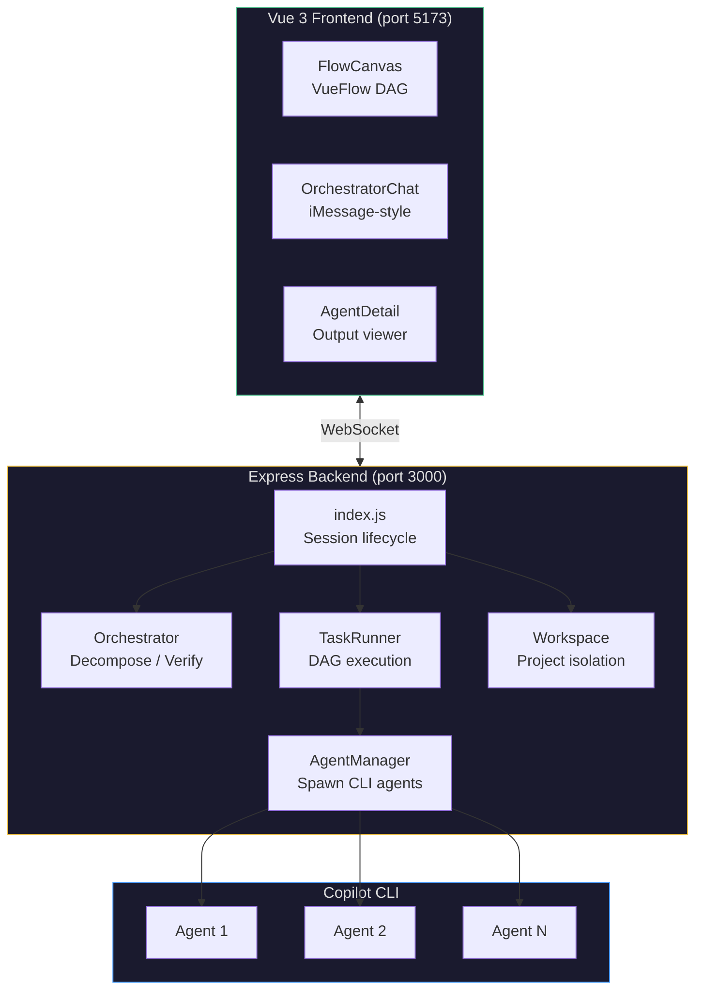
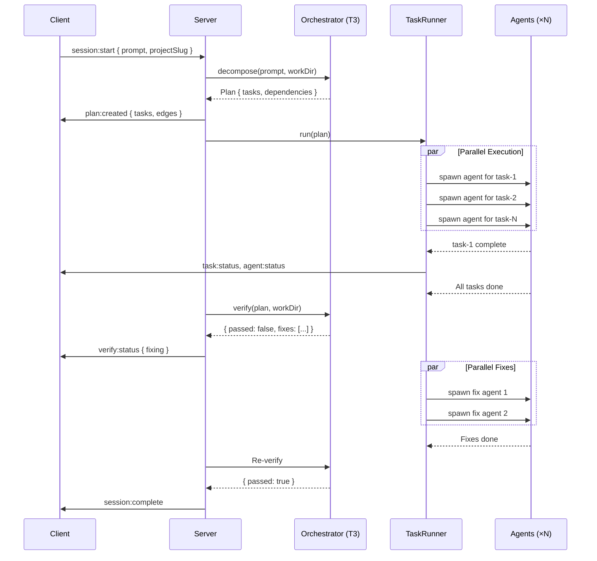
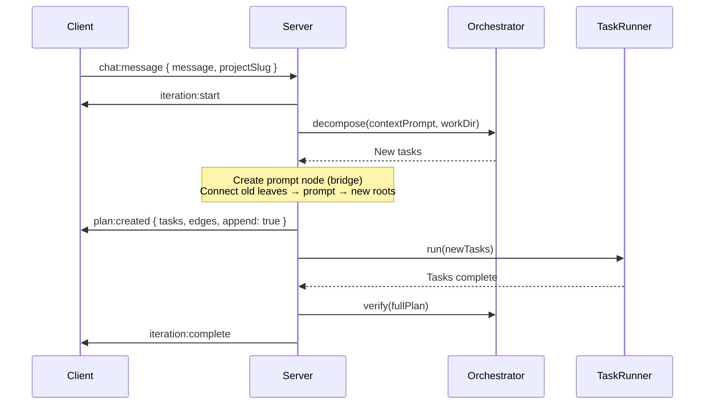
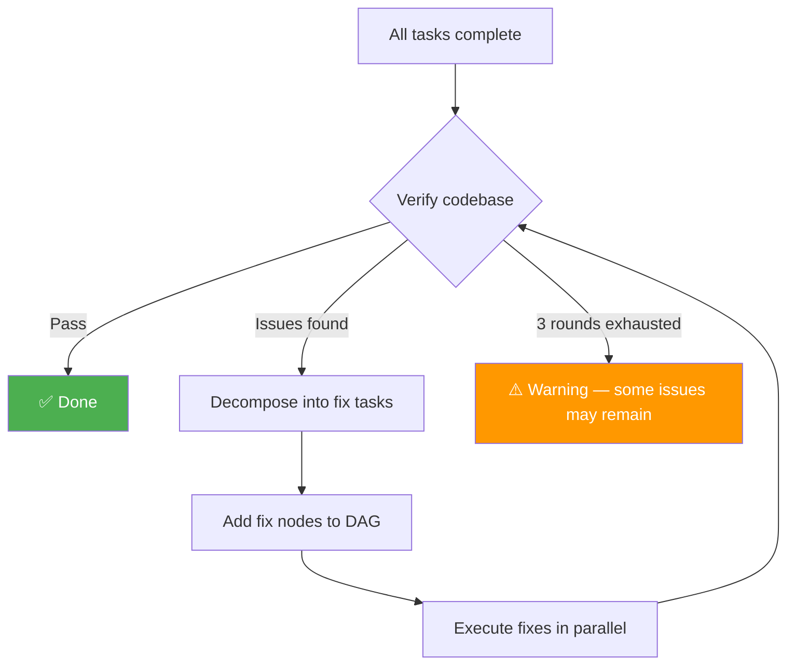

# Architecture

## System Overview

## Data Flow

### Initial Session

### Iteration (Chat Follow-up)

## Component Responsibilities

### Server

| Module | Role |
|--------|------|
| **index.js** | Express + WS server, session lifecycle, REST API, iteration handler, verify-fix loop |
| **orchestrator.js** | Calls T3 model for: task decomposition, code verification, failure analysis |
| **taskRunner.js** | DAG scheduler — resolves dependencies, launches eligible tasks, handles retry/escalation |
| **agentManager.js** | Spawns `copilot` CLI processes, streams output, tracks agent lifecycle |
| **config.js** | Model definitions, tier defaults, escalation chain |
| **workspace.js** | Creates per-project directories, manages session persistence |

### Client

| Component | Role |
|-----------|------|
| **App.vue** | Root layout, WS event handlers, step flow (project → prompt → workspace) |
| **FlowCanvas.vue** | VueFlow DAG with auto-layout, status coloring, edge highlighting, auto-viewport |
| **AgentNode.vue** | Task node — status icon, model badge, live runtime timer |
| **OrchestratorChat.vue** | Chat panel — task-attributed messages, agent assignments, completions |
| **AgentDetail.vue** | Raw agent output viewer (stdout/stderr) |

### Shared

| Module | Role |
|--------|------|
| **protocol.js** | WebSocket message type constants and serialization helpers |

## WebSocket Protocol

All messages are JSON: `{ type: string, payload: object }`

### Client → Server

| Type | Payload | Description |
|------|---------|-------------|
| `session:start` | `{ prompt, projectSlug }` | Start a new build session |
| `chat:message` | `{ message, projectSlug }` | Send iteration request |

### Server → Client

| Type | Payload | Description |
|------|---------|-------------|
| `plan:created` | `{ tasks, edges, append? }` | DAG plan (initial or appended) |
| `task:status` | `{ taskId, status, startedAt, completedAt }` | Task state change |
| `agent:status` | `{ agentId, taskId, taskLabel, model, status }` | Agent lifecycle event |
| `agent:output` | `{ agentId, chunk }` | Streaming agent stdout/stderr |
| `session:complete` | `{ costSummary }` | All tasks done |
| `session:error` | `{ error }` | Fatal error |
| `verify:status` | `{ status, message, issues? }` | Verification progress |
| `iteration:start` | `{ iterationId, prompt }` | Chat iteration beginning |
| `iteration:complete` | `{ costSummary }` | Chat iteration done |

## Verify-Fix Loop

The loop runs up to 3 rounds. Each round's fix tasks appear as real nodes in the DAG, giving full visibility into what's being fixed.
