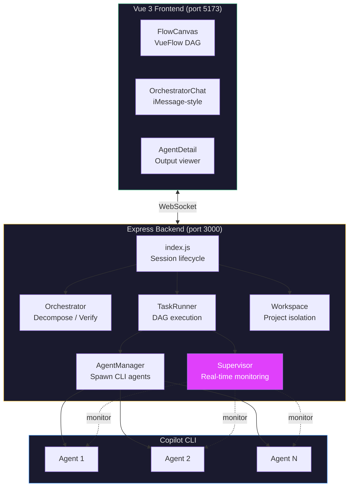
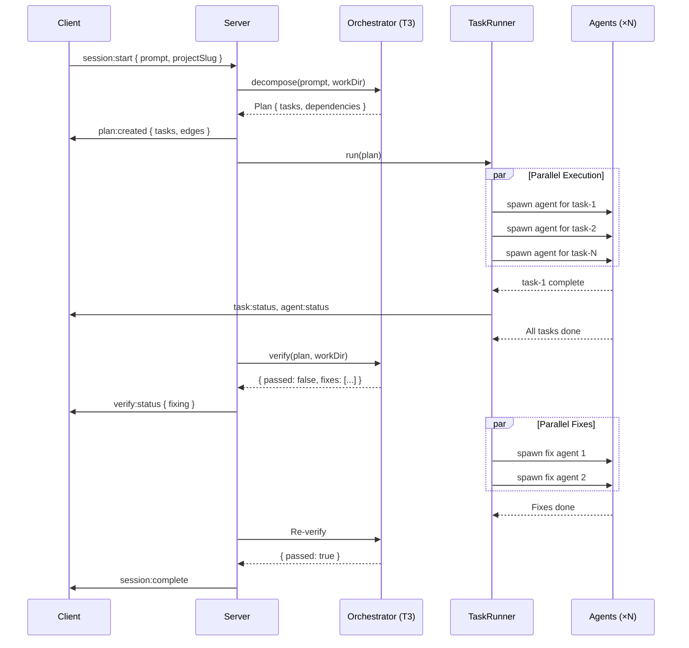
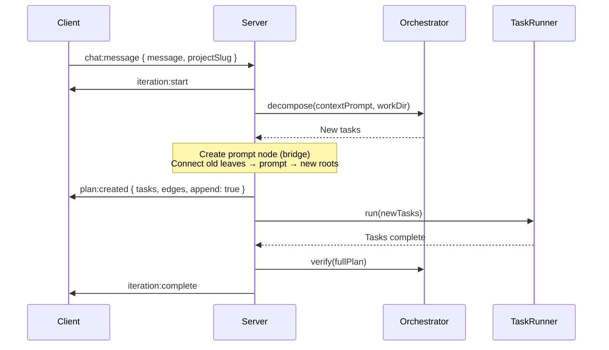
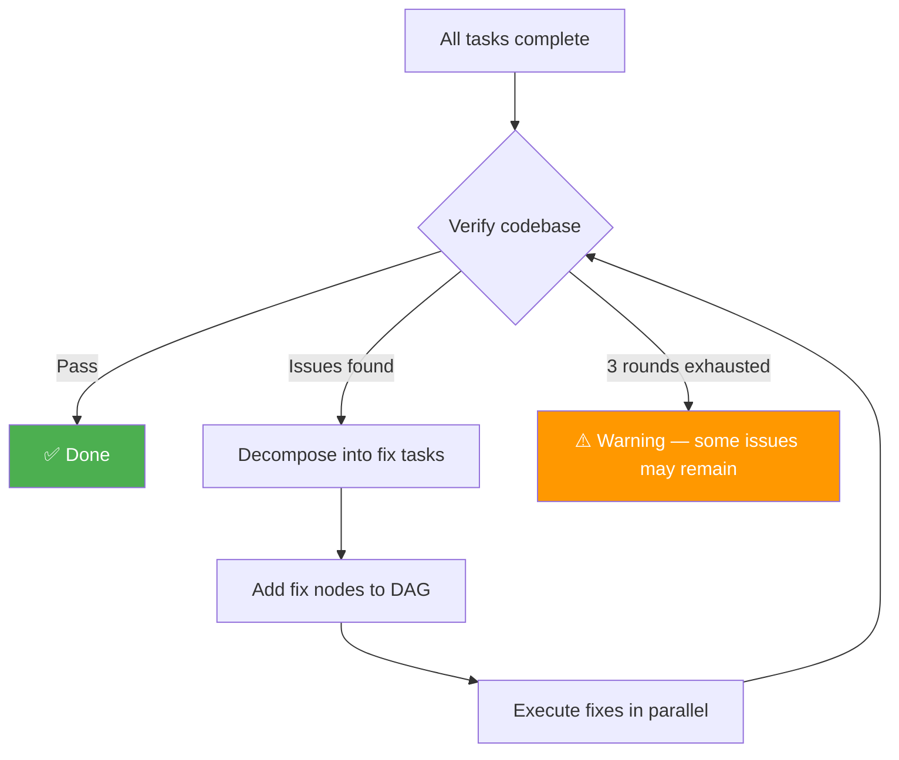

# Architecture

## System Overview

```mermaid
graph TB
  subgraph Frontend["Vue 3 Frontend (port 5173)"]
    FC["FlowCanvas<br/>VueFlow DAG"]
    OC["OrchestratorChat<br/>iMessage-style"]
    AD["AgentDetail<br/>Output viewer"]
  end

  subgraph Backend["Express Backend (port 3000)"]
    IX["index.js<br/>Session lifecycle"]
    OR["Orchestrator<br/>Decompose / Verify"]
    SV["Supervisor<br/>Real-time monitoring"]
    TR["TaskRunner<br/>DAG execution"]
    AM["AgentManager<br/>Spawn CLI agents"]
    WM["Workspace<br/>Project isolation"]
  end

  subgraph CLI["Copilot CLI"]
    A1["Agent 1"]
    A2["Agent 2"]
    AN["Agent N"]
  end

  Frontend <-->|"WebSocket"| Backend
  AM --> A1
  AM --> A2
  AM --> AN
  IX --> OR
  IX --> TR
  TR --> AM
  TR --> SV
  SV -.->|"monitor"| A1
  SV -.->|"monitor"| A2
  SV -.->|"monitor"| AN
  IX --> WM

  style Frontend fill:#1a1a2e,color:#e0e0e0,stroke:#4FC08D
  style Backend fill:#1a1a2e,color:#e0e0e0,stroke:#f5c542
  style CLI fill:#1a1a2e,color:#e0e0e0,stroke:#4a9eff
  style SV fill:#e040fb,color:#fff
```

## Data Flow

### Initial Session

```mermaid
sequenceDiagram
  participant C as Client
  participant S as Server
  participant O as Orchestrator (T3)
  participant R as TaskRunner
  participant A as Agents (×N)

  C->>S: session:start { prompt, projectSlug }
  S->>O: decompose(prompt, workDir)
  O-->>S: Plan { tasks, dependencies }
  S->>C: plan:created { tasks, edges }
  S->>R: run(plan)
  
  par Parallel Execution
    R->>A: spawn agent for task-1
    R->>A: spawn agent for task-2
    R->>A: spawn agent for task-N
  end

  A-->>R: task-1 complete
  R->>C: task:status, agent:status
  A-->>R: All tasks done
  
  S->>O: verify(plan, workDir)
  O-->>S: { passed: false, fixes: [...] }
  S->>C: verify:status { fixing }
  
  par Parallel Fixes
    R->>A: spawn fix agent 1
    R->>A: spawn fix agent 2
  end
  
  A-->>R: Fixes done
  S->>O: Re-verify
  O-->>S: { passed: true }
  S->>C: session:complete
```

### Iteration (Chat Follow-up)

```mermaid
sequenceDiagram
  participant C as Client
  participant S as Server
  participant O as Orchestrator
  participant R as TaskRunner

  C->>S: chat:message { message, projectSlug }
  S->>C: iteration:start
  S->>O: decompose(contextPrompt, workDir)
  O-->>S: New tasks
  
  Note over S: Create prompt node (bridge)<br/>Connect old leaves → prompt → new roots
  
  S->>C: plan:created { tasks, edges, append: true }
  S->>R: run(newTasks)
  R-->>S: Tasks complete
  S->>O: verify(fullPlan)
  S->>C: iteration:complete
```

## Component Responsibilities

### Server

| Module | Role |
|--------|------|
| **index.js** | Express + WS server, session lifecycle, REST API, iteration handler, verify-fix loop |
| **orchestrator.js** | Calls T3 model for: task decomposition, code verification, failure analysis |
| **taskRunner.js** | DAG scheduler — dependency resolution, dynamic concurrency scaling (8→20), speculative execution, wave detection, task splitting, retry/escalation |
| **agentManager.js** | Spawns `copilot` CLI processes, streams output, tracks agent lifecycle. Integrates prompt guard and credential redaction. |
| **config.js** | Model definitions, tier defaults, escalation chain |
| **workspace.js** | Creates per-project directories, manages session persistence |

### Intelligence Layer (Phase 14)

| Module | Role |
|--------|------|
| **vectorMemory.js** | Pure-JS HNSW index with FNV-1a trigram embeddings (128-dim). Cosine similarity search, project-scoped indices. |
| **patternBank.js** | Records decomposition/model/failure patterns. 12-category task categorization. Few-shot context injection. |
| **taskRouter.js** | Epsilon-greedy learned model routing (15% exploration). Tracks success per model per category. |
| **knowledgeGraph.js** | Adjacency-list graph: file↔task, error↔fix relationships. Multi-hop traversal, degree ranking. |

### Backends (Phase 15)

| Module | Role |
|--------|------|
| **copilot.js** | GitHub Copilot CLI — default, free-tier backend |
| **ollama.js** | Local Ollama models |
| **anthropic.js** | Direct Anthropic Messages API (no SDK) — simulated ChildProcess |
| **openai.js** | Direct OpenAI Chat Completions API (no SDK) — simulated ChildProcess |
| **providerFailover.js** | Health tracking (3-strike cooldown), tier→provider mapping, automatic failover |

### Swarm Intelligence (Phase 16)

| Module | Role |
|--------|------|
| **topologies.js** | 5 swarm topologies (flat/hierarchical/ring/star/mesh), factory pattern |
| **consensus.js** | 3 consensus strategies (majority-vote/quality-ranked/merge), confidence scoring |

### Security (Phase 18)

| Module | Role |
|--------|------|
| **inputSanitizer.js** | Express middleware: control chars, prototype pollution, depth/array limits |
| **promptGuard.js** | 16 injection patterns across 5 categories, risk scoring, output leak scanning |
| **credentialRedactor.js** | 12 credential patterns (API keys, private keys, JWT, bearer tokens, DB URLs) |

### Task Supervision — Asynchronous String (Phase 21)

> Concept by **CC** — a middle-management supervisor layer between the orchestrator and executing agents.

| Module | Role |
|--------|------|
| **taskSupervisor.js** | Real-time agent output monitoring, divergence detection (5 categories: loop/error-spiral/stall/scope-drift/off-topic), automatic course correction (kill-and-restart with enriched context), upward aggregation (health-scored digests), horizontal context sharing (export/route extraction across tasks), progressive verification (post-task lightweight checks) |

### Client

| Component | Role |
|-----------|------|
| **App.vue** | Root layout, WS event handlers, step flow (project → prompt → workspace) |
| **FlowCanvas.vue** | VueFlow DAG with auto-layout, status coloring, edge highlighting, auto-viewport |
| **AgentNode.vue** | Task node — status icon, model badge, live runtime timer |
| **OrchestratorChat.vue** | Chat panel — task-attributed messages, agent assignments, completions |
| **AgentDetail.vue** | Raw agent output viewer (stdout/stderr) |

### Shared

| Module | Role |
|--------|------|
| **protocol.js** | WebSocket message type constants and serialization helpers |

## WebSocket Protocol

All messages are JSON: `{ type: string, payload: object }`

### Client → Server

| Type | Payload | Description |
|------|---------|-------------|
| `session:start` | `{ prompt, projectSlug }` | Start a new build session |
| `chat:message` | `{ message, projectSlug }` | Send iteration request |

### Server → Client

| Type | Payload | Description |
|------|---------|-------------|
| `plan:created` | `{ tasks, edges, append? }` | DAG plan (initial or appended) |
| `task:status` | `{ taskId, status, startedAt, completedAt }` | Task state change |
| `agent:status` | `{ agentId, taskId, taskLabel, model, status }` | Agent lifecycle event |
| `agent:output` | `{ agentId, chunk }` | Streaming agent stdout/stderr |
| `session:complete` | `{ costSummary, swarmStats }` | All tasks done (includes wave/concurrency/speculative stats) |
| `session:error` | `{ error }` | Fatal error |
| `verify:status` | `{ status, message, issues? }` | Verification progress |
| `iteration:start` | `{ iterationId, prompt }` | Chat iteration beginning |
| `iteration:complete` | `{ costSummary }` | Chat iteration done |
| `swarm:wave` | `{ wave, totalWaves, stats }` | Wave progress update |
| `task:speculative` | `{ taskId, pendingDeps }` | Task started speculatively |
| `task:split` | `{ taskId, subTasks }` | Task split into sub-tasks |
| `injection:detected` | `{ prompt, threats }` | Prompt injection blocked |
| `credential:redacted` | `{ agentId, count }` | Credentials stripped from output |
| `provider:failover` | `{ from, to, reason }` | Backend failover triggered |
| `swarm:topology` | `{ type, assignments }` | Swarm topology applied |
| `swarm:consensus` | `{ strategy, winnerId }` | Multi-agent consensus result |
| `pattern:learned` | `{ type, category }` | New pattern recorded |
| `routing:decision` | `{ model, reason }` | Learned routing applied |
| `supervisor:alert` | `{ agentId, category, severity, message }` | Supervisor divergence alert |
| `supervisor:digest` | `{ agents, overallHealth }` | Periodic supervisor progress digest |
| `supervisor:correction` | `{ agentId, action, reason }` | Supervisor course correction issued |
| `supervisor:status` | `{ active, agentCount, stats }` | Supervisor status update |

## Verify-Fix Loop

```mermaid
flowchart TD
  A[All tasks complete] --> B{Verify codebase}
  B -->|Pass| C[✅ Done]
  B -->|Issues found| D[Decompose into fix tasks]
  D --> E[Add fix nodes to DAG]
  E --> F[Execute fixes in parallel]
  F --> B
  B -->|3 rounds exhausted| G[⚠️ Warning — some issues may remain]

  style C fill:#4caf50,color:#fff
  style G fill:#ff9800,color:#fff
```

The loop runs up to 3 rounds. Each round's fix tasks appear as real nodes in the DAG, giving full visibility into what's being fixed.
