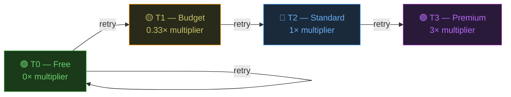

# Model Tiering & Escalation

hAIvemind uses a 4-tier model system aligned with [GitHub Copilot's premium request multipliers](https://docs.github.com/en/copilot/concepts/billing/copilot-requests#model-multipliers). The goal: **use free models by default, escalate only when necessary.**

## Tiers



### T0 — Free (0× multiplier)

Included in all paid Copilot plans. Used aggressively for first attempts.

| Model | Notes |
|-------|-------|
| **gpt-5.1** ⭐ | Default. Strong baseline coder |
| gpt-5 | Alternative |
| gpt-5.2 | Latest in series |

### T1 — Budget (0.33× multiplier)

Very cheap. Used for first escalation retries.

| Model | Notes |
|-------|-------|
| **claude-haiku-4.5** ⭐ | Default. Fast, competent coder |
| gemini-3-pro-preview | Alternative |

### T2 — Standard (1× multiplier)

Strong coders. Reserved for tasks that lower tiers can't handle.

| Model | Notes |
|-------|-------|
| **claude-sonnet-4.5** ⭐ | Default. Top-tier coding at standard cost |
| claude-sonnet-4 | Previous gen |
| gpt-5.1-codex | Code-specialized |
| gpt-5.1-codex-max | Extended context |
| gpt-5.2-codex | Latest codex |

### T3 — Premium (3× multiplier)

Heavy hitters. Used for orchestration (decomposition, verification) and absolute last resort for worker tasks.

| Model | Notes |
|-------|-------|
| **claude-opus-4.5** ⭐ | Default. Orchestrator model |

## Escalation Chain

When a task fails, it retries with progressively more capable (and expensive) models:

```
Retry 0 → T0 (gpt-5.1)          — Free
Retry 1 → T0 (gpt-5.1)          — Free (same tier, with failure context)
Retry 2 → T1 (claude-haiku-4.5) — 0.33×
Retry 3 → T2 (claude-sonnet-4.5) — 1×
Retry 4 → T3 (claude-opus-4.5)  — 3×
Retry 5 → BLOCKED                — Task marked as blocked
```

Each retry includes the previous failure output as context, so the escalated model knows what went wrong.

## Orchestrator vs Workers

| Role | Tier | Purpose |
|------|------|---------|
| **Orchestrator** | T3 | Decomposes prompts, verifies results, analyzes failures |
| **Workers** | T0 (default) | Execute individual tasks, escalate on failure |

The orchestrator always uses the highest tier because its decisions affect the entire project. Workers start free and only escalate if they fail.

## Cost Example

Building a 7-task project:

| Phase | Agents | Tier | Cost |
|-------|--------|------|------|
| Decompose | 1 | T3 | 3× |
| Execute 7 tasks | 7 | T0 | 0× (free) |
| Verify | 1 | T3 | 3× |
| **Total** | **9** | | **6× premium requests** |

If 2 tasks fail and retry to T1:

| Phase | Agents | Tier | Cost |
|-------|--------|------|------|
| 2 retries | 2 | T0 | 0× |
| 2 escalations | 2 | T1 | 0.66× |
| Re-verify | 1 | T3 | 3× |
| **Additional** | **5** | | **3.66×** |

## Customization

Edit [`server/config.js`](../server/config.js) to:
- Change tier defaults (`tierDefaults`)
- Modify the escalation chain (`escalation`)  
- Adjust max retries (`maxRetriesTotal`)
- Change orchestrator tier (`orchestratorTier`)
- Set max concurrency (`maxConcurrency`) — how many agents run in parallel
- Point to a different CLI binary (`COPILOT_CMD` env var)
