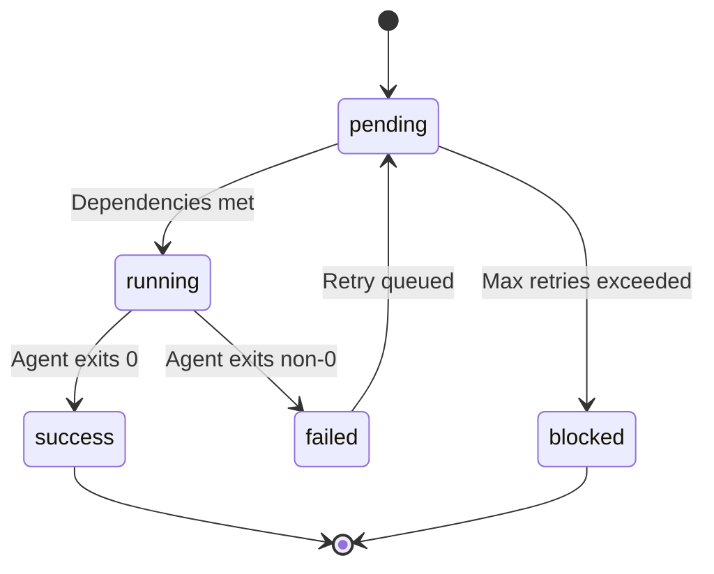
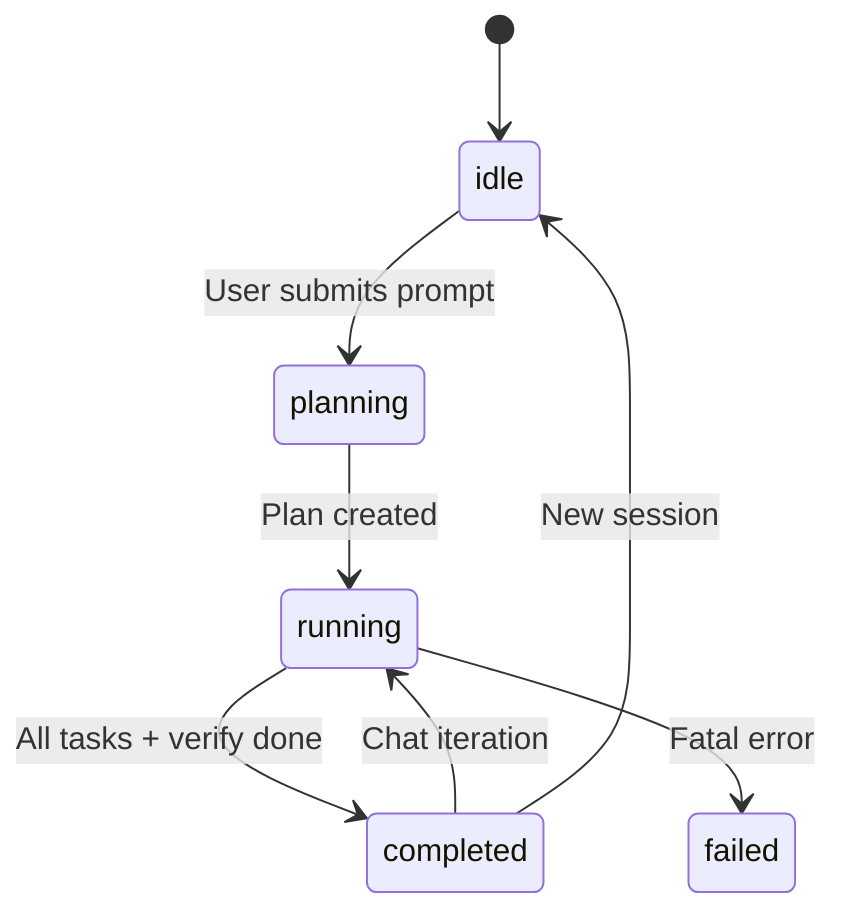

# Project Structure

```
hAIvemind/
├── server/                    # Backend (Express + WebSocket)
├── client/                    # Frontend (Vue 3 + VueFlow)
├── shared/                    # Code shared between server & client
├── resources/                 # Logo & demo screenshots
├── docs/                      # Documentation
├── package.json               # Root package: scripts, server deps
└── .gitignore
```

## Server

| File | Lines | Description |
|------|-------|-------------|
| **index.js** | ~580 | Express HTTP + WebSocket server. Handles `session:start`, `chat:message`. Orchestrates the full lifecycle: decompose → execute → verify-fix loop → complete. REST API for project/session CRUD. |
| **orchestrator.js** | ~260 | Calls the T3 model for three operations: `decompose()` (prompt → task plan), `verify()` (codebase review → issues + fix tasks), `analyzeFailure()` (failed output → structured report). Parses JSON from model output. |
| **taskRunner.js** | ~170 | DAG executor. Resolves dependencies via topological scheduling, launches eligible tasks in parallel (up to `maxConcurrency`), handles failures with retry counter, broadcasts status changes. |
| **agentManager.js** | ~240 | Spawns `copilot` CLI as child processes. Manages agent lifecycle (running → success/failed), streams stdout/stderr, builds escalation reasons, tracks cost. Provides session snapshots for persistence. |
| **config.js** | ~100 | All model definitions (13 models across 4 tiers), tier defaults, escalation chain, orchestrator tier, concurrency limits, port config. Exports helper functions: `getModelForRetry()`, `getOrchestratorModel()`. |
| **workspace.js** | — | Creates per-project directories under `.haivemind-workspace/`, manages session JSON files, handles project linking (external directories). |
| **mock.js** | — | Mock agent spawner for demo mode. Simulates delays and random success/failure. |

## Client

### Entry

| File | Description |
|------|-------------|
| **main.js** | Vue app creation and mount |
| **App.vue** | Root component — header, step flow (project → prompt → workspace), WS event wiring, side panel with tabs (Agent / Chat) |

### Components

| Component | Description |
|-----------|-------------|
| **FlowCanvas.vue** | VueFlow DAG canvas. Auto-layout from task list. Dynamic edge coloring (blue=active, green=done, red=failed). Auto-viewport focus on running nodes. Completion banner. |
| **AgentNode.vue** | Individual task node. Shows status icon, label, model badge, retry count, live runtime timer (ticks every second while running). |
| **BookendNode.vue** | START and END nodes. END changes appearance on completion/failure. |
| **PromptNode.vue** | 💬 bridge node between iterations — shows the user's follow-up message. |
| **OrchestratorChat.vue** | Chat panel with task-attributed messages. Shows agent assignments ("🐝 Task → model"), completions, escalations, failures, verification status. User bubbles left (blue), orchestrator bubbles right (dark). |
| **AgentDetail.vue** | Raw output viewer for a selected agent (stdout/stderr stream). |
| **ProjectPicker.vue** | Create/select/link projects. |
| **PromptInput.vue** | Large textarea for the initial build prompt. |
| **SessionHistory.vue** | Browse and reload past sessions for a project. |

### Composables

| File | Description |
|------|-------------|
| **useSession.js** | Singleton reactive state: `sessionStatus`, `tasks`, `edges`, `taskStatusMap`, `agentMap`, `agentOutputMap`, `costSummary`. Provides `resetSession()`, `loadSession()`. |
| **useWebSocket.js** | Singleton WebSocket connection with `on(type, callback)` multi-handler pattern and `send(type, payload)`. Auto-reconnect. |
| **useProjects.js** | Project CRUD via REST API. Reactive `activeProject`, `sessions` list. |

### Utils

| File | Description |
|------|-------------|
| **layout.js** | Topological DAG layout (Kahn's algorithm). Groups nodes into depth layers, adds START/END bookends, creates edges with styling. Handles prompt nodes for iteration bridges. |

## Shared

| File | Description |
|------|-------------|
| **protocol.js** | WebSocket message type constants (`MSG.SESSION_START`, `MSG.PLAN_CREATED`, etc.) and `makeMsg()` / `parseMsg()` helpers. Used by both server and client. |

## Key Data Flows

### Task State Machine



### Session State Machine


