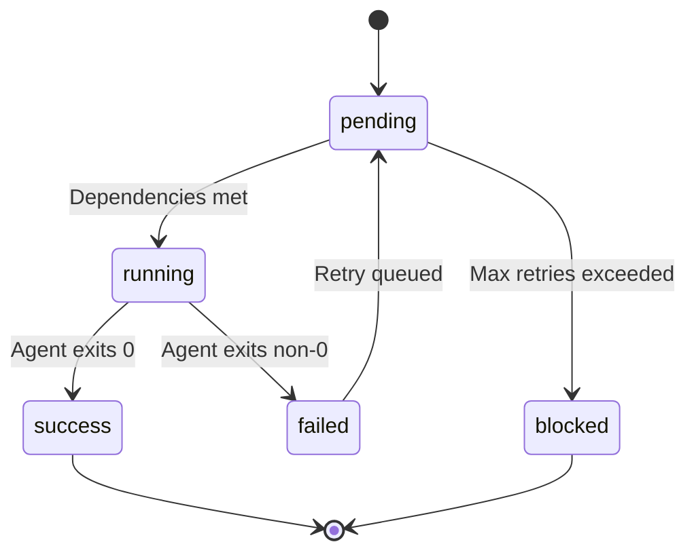
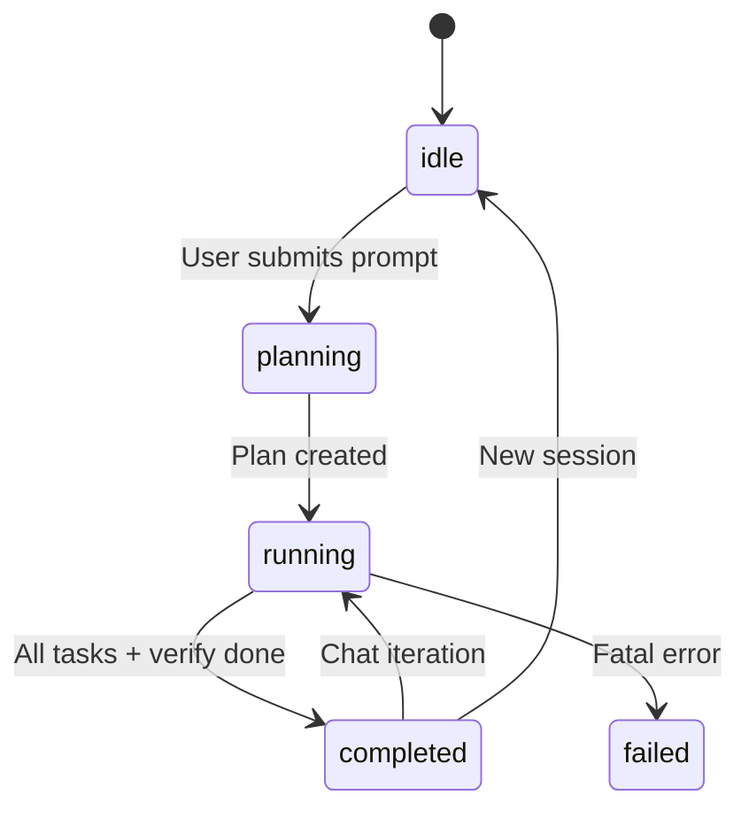

# Project Structure

```
hAIvemind/
├── server/                    # Backend (Express + WebSocket)
├── client/                    # Frontend (Vue 3 + VueFlow)
├── shared/                    # Code shared between server & client
├── resources/                 # Logo & demo screenshots
├── docs/                      # Documentation
├── package.json               # Root package: scripts, server deps
└── .gitignore
```

## Server

| File | Lines | Description |
|------|-------|-------------|
| **index.js** | ~155 | Express HTTP + WebSocket server. Thin wiring only — mounts routes, error handlers, crash guards. |
| **orchestrator.js** | ~260 | Calls the T3 model for decompose(), verify(), analyzeFailure(). Parses JSON from model output. |
| **taskRunner.js** | ~750 | DAG executor with swarm parallelism. Dynamic concurrency scaling, speculative execution, wave detection, task splitting, retry/escalation. |
| **agentManager.js** | ~240 | Spawns `copilot` CLI as child processes. Manages agent lifecycle, streams output, tracks cost & escalation. |
| **config.js** | ~100 | Model definitions (13 models × 4 tiers), escalation chain, concurrency limits, port config. |
| **workspace.js** | — | Per-project directories under `.haivemind-workspace/`, session JSON, project linking. |
| **state.js** | — | Shared state singleton (`refs`) — cross-module references without globals. |
| **mock.js** | — | Mock agent spawner for demo mode. Simulates delays and random success/failure. |
| **autopilot.js** | — | Autonomous multi-cycle build loop with goal checking. |
| **logger.js** | — | Structured logger with level filtering and format modes (pretty/json). |
| **outputSummarizer.js** | — | Truncates/summarizes large agent outputs to stay within token limits. |
| **pluginManager.js** | — | Plugin discovery, loading, lifecycle management. |
| **processTimeout.js** | — | Agent process timeout + stall detection with configurable thresholds. |
| **selfDev.js** | — | Self-development mode — hAIvemind developing its own codebase. |
| **sessionCheckpoint.js** | — | Checkpoint/resume for interrupted sessions (SIGTERM persistence). |
| **snapshot.js** | — | Git-based workspace snapshots (pre/post-session tags, rollback). |
| **workspaceAnalyzer.js** | — | Static analysis of workspace files (package.json, tsconfig, etc.). |

### Route Modules (23 files)

| File | Description |
|------|-------------|
| **health.js** | Health check, version info |
| **sessions.js** | Session CRUD, start, stop, replay, interrupted session management |
| **backends.js** | Backend switching (Copilot/Ollama/Anthropic/OpenAI/Swarm) |
| **plugins.js** | Plugin management REST API |
| **autopilot.js** | Autopilot mode endpoints |
| **auth.js** | Authentication middleware and token management |
| **intelligence.js** | Intelligence REST API — vectors, patterns, routing, graph |
| **projects.js** | Thin re-exporter → mounts 15 domain routers below |
| **projectCore.js** | Project CRUD, skills, reflections, settings, cost-history, export/import |
| **webhooks.js** | Webhook CRUD, delivery history, test, verify |
| **scheduling.js** | Retry policy, benchmarks, schedules, queue, scheduled tasks |
| **notifications.js** | Notifications, unread counts |
| **security.js** | API keys, rate limiting |
| **templates.js** | Session and project templates |
| **auditCollab.js** | Audit log, collaboration/presence |
| **analytics.js** | Session analytics, performance profiling |
| **memory.js** | Agent memory, prompt suggestions |
| **resources.js** | Resource monitor, health dashboard |
| **codeReview.js** | Diff review, workspace snapshots |
| **events.js** | Event bus routes |
| **sessionOps.js** | Session replay, session comparison |
| **taskManagement.js** | Task deps, retry/recovery, decomposition, pipelines |
| **agentConfig.js** | Cost budgets, global search, agent profiles, dashboard widgets |

### Middleware (`middleware/` — 1 file)

| File | Description |
|------|-------------|
| **inputSanitizer.js** | Express middleware: control char stripping, prototype pollution blocking, depth/array limiting |

### Services (51 files)

<details>
<summary>Full service module listing</summary>

| File | Description |
|------|-------------|
| **sessions.js** | Session lifecycle, cost aggregation, session queries |
| **agentMemory.js** | Per-agent memory store for context recall across sessions |
| **agentProfiles.js** | Agent profile management and specialization |
| **analysis.js** | Code analysis and workspace intelligence |
| **analytics.js** | Session analytics and metrics aggregation |
| **apiKeys.js** | API key creation, validation, scoping |
| **auditLog.js** | Append-only audit trail for all actions |
| **auth.js** | Authentication and authorization service |
| **benchmarks.js** | Performance benchmark computation |
| **collaboration.js** | Multi-user presence and lock management |
| **costBudgets.js** | Spend tracking, alerts, budget enforcement |
| **customPipelines.js** | User-defined multi-step build pipelines |
| **dashboardWidgets.js** | Configurable dashboard widget store |
| **diffReview.js** | Diff review service — hunk-level review, bulk review, revert |
| **eventBus.js** | In-process event pub/sub |
| **globalSearch.js** | Cross-project full-text search |
| **healthDashboard.js** | System health aggregation (CPU, memory, disk) |
| **notificationChannels.js** | Multi-channel notification delivery |
| **notifications.js** | Notification CRUD per project |
| **performanceProfiling.js** | Operation timing, percentiles, profiling |
| **projectExport.js** | Project export/import as archive |
| **projectTemplates.js** | Built-in + custom project scaffolding templates |
| **promptSuggestions.js** | AI-assisted prompt suggestions based on project state |
| **rateLimiter.js** | Per-project/global rate limiting |
| **recovery.js** | Failure recovery strategies |
| **resourceMonitor.js** | Resource usage monitoring (memory, CPU per agent) |
| **retryPolicy.js** | Configurable retry policies with backoff strategies |
| **retryRecovery.js** | Retry record tracking and recovery logic |
| **scheduledTasks.js** | Cron-like scheduled task execution |
| **scheduler.js** | Priority queue and schedule management |
| **sessionComparison.js** | Side-by-side session comparison |
| **sessionReplay.js** | Session event replay with timeline |
| **sessionTemplates.js** | Per-project reusable session prompt presets |
| **shutdown.js** | Graceful shutdown coordination |
| **smartDecomposition.js** | Advanced task decomposition with merge/split |
| **taskDependencies.js** | Task dependency graph operations |
| **webhooks.js** | Webhook delivery, retry, signature verification |
| **workspaceSnapshots.js** | Git-based workspace snapshots and diffs |
| **vectorMemory.js** | Pure-JS HNSW index with trigram embeddings for semantic vector search |
| **patternBank.js** | Session outcome pattern learning — decomposition, model success, failure→fix |
| **taskRouter.js** | Epsilon-greedy learned model routing based on historical success rates |
| **knowledgeGraph.js** | Adjacency-list knowledge graph — file↔task, error↔fix relationships |
| **providerFailover.js** | Provider health tracking and automatic failover with tier→provider mapping |
| **promptGuard.js** | Prompt injection detection (16 patterns, 5 categories) and sanitization |
| **credentialRedactor.js** | API key/token/password redaction (12 credential patterns) |
| **cliDashboard.js** | ANSI terminal dashboard — task progress, agent sparkline, cost meter |
| **repoMap.js** | AST-aware symbol extraction for 8 languages — function/class/export mapping for orchestrator context |
| **githubIssues.js** | GitHub issue fetching via raw API, URL/ref parsing, issue→prompt conversion |
| **taskCheckpoints.js** | Per-task workspace snapshots via git write-tree, granular rollback, diff comparison |
| **crossProjectLearning.js** | Global pattern promotion/search across projects, cross-project context injection |
| **streamingDiffs.js** | Real-time file watcher with debouncing, git diff integration, WebSocket diff broadcast |

</details>

### WebSocket (`ws/` — 3 files)

| File | Description |
|------|-------------|
| **setup.js** | WebSocket server initialization and upgrade handling |
| **handlers.js** | Message type routing and per-client state |
| **broadcast.js** | Broadcasting utilities for multi-client push |

### Backends (`backends/` — 6 files)

| File | Description |
|------|-------------|
| **base.js** | Abstract backend interface |
| **copilot.js** | GitHub Copilot CLI backend |
| **ollama.js** | Ollama local model backend |
| **anthropic.js** | Direct Anthropic Messages API backend |
| **openai.js** | Direct OpenAI Chat Completions API backend |
| **backends/index.js** | Backend registry and switching |

### Swarm (`swarm/` — 6 files)

| File | Description |
|------|-------------|
| **index.js** | Swarm coordinator — scales across multiple runners |
| **localRunner.js** | Local process runner |
| **dockerRunner.js** | Docker container runner |
| **sshRunner.js** | Remote SSH runner |
| **topologies.js** | 5 swarm topology types (flat/hierarchical/ring/star/mesh) |
| **consensus.js** | Multi-agent consensus (majority-vote/quality-ranked/merge) |

## Client

### Entry

| File | Description |
|------|-------------|
| **main.js** | Vue app creation and mount |
| **App.vue** | Root component — header, step flow (project → prompt → workspace), WS event wiring, side panel with tabs (Agent / Chat) |

### Components

| Component | Description |
|-----------|-------------|
| **FlowCanvas.vue** | VueFlow DAG canvas. Auto-layout from task list. Dynamic edge coloring (blue=active, green=done, red=failed). Auto-viewport focus on running nodes. Completion banner. |
| **AgentNode.vue** | Individual task node. Shows status icon, label, model badge, retry count, live runtime timer (ticks every second while running). |
| **BookendNode.vue** | START and END nodes. END changes appearance on completion/failure. |
| **PromptNode.vue** | 💬 bridge node between iterations — shows the user's follow-up message. |
| **OrchestratorChat.vue** | Chat panel with task-attributed messages. Shows agent assignments ("🐝 Task → model"), completions, escalations, failures, verification status. User bubbles left (blue), orchestrator bubbles right (dark). |
| **AgentDetail.vue** | Raw output viewer for a selected agent (stdout/stderr stream). |
| **ProjectPicker.vue** | Landing page with hero section, project search/filter, colored avatars. |
| **PromptInput.vue** | Textarea with gradient border, tier escalation chain cards, template selector. |
| **SessionHistory.vue** | Browse and reload past sessions for a project. Workspace intelligence view. |
| **SessionSearch.vue** | Full-text search across sessions by prompt/task. Debounced input, match highlighting, cross-project results. |
| **CostChart.vue** | Historical cost analytics chart with tier-colored stacked bars, hover detail panel, totals summary. |
| **CommandPalette.vue** | Ctrl+K overlay: searchable command list with navigation, actions, project switching, panel toggling. |
| **ToastContainer.vue** | Animated toast notification stack. Renders success/error/warning/info toasts with auto-dismiss. |
| **KeyboardShortcutsHelp.vue** | `?` key dialog: grouped list of all keyboard shortcuts with key labels. |

### Composables

| File | Description |
|------|-------------|
| **useSession.js** | Singleton reactive state: `sessionStatus`, `tasks`, `edges`, `taskStatusMap`, `agentMap`, `agentOutputMap`, `costSummary`. Provides `resetSession()`, `loadSession()`. |
| **useWebSocket.js** | Singleton WebSocket connection with `on(type, callback)` multi-handler pattern and `send(type, payload)`. Auto-reconnect. |
| **useProjects.js** | Project CRUD via REST API. Reactive `activeProject`, `sessions` list. Sort by createdAt descending. |
| **useCommandPalette.js** | Command palette state: `paletteOpen`, `paletteQuery`, command registry with `setCommands()`, `filteredCommands`. |
| **useToast.js** | Toast notification stack: `showToast()`, `dismissToast()`, convenience `toast.success/error/warning/info()`. |
| **useKeyboardShortcuts.js** | Global keyboard shortcut system: `registerShortcuts()`, `installShortcutListener()`, `?` help dialog toggle. Auto-suppresses in inputs. |

### Utils

| File | Description |
|------|-------------|
| **layout.js** | Topological DAG layout (Kahn's algorithm). Groups nodes into depth layers, adds START/END bookends, creates edges with styling. Handles prompt nodes for iteration bridges. |

## Shared

| File | Description |
|------|-------------|
| **protocol.js** | WebSocket message type constants (`MSG.SESSION_START`, `MSG.PLAN_CREATED`, etc.) and `makeMsg()` / `parseMsg()` helpers. Used by both server and client. |

## Key Data Flows

### Task State Machine


```mermaid
stateDiagram-v2
  [*] --> pending
  pending --> running: Dependencies met
  running --> success: Agent exits 0
  running --> failed: Agent exits non-0
  failed --> pending: Retry queued
  pending --> blocked: Max retries exceeded
  success --> [*]
  blocked --> [*]
```

### Session State Machine


```mermaid
stateDiagram-v2
  [*] --> idle
  idle --> planning: User submits prompt
  planning --> running: Plan created
  running --> completed: All tasks + verify done
  running --> failed: Fatal error
  completed --> running: Chat iteration
  completed --> idle: New session
```
